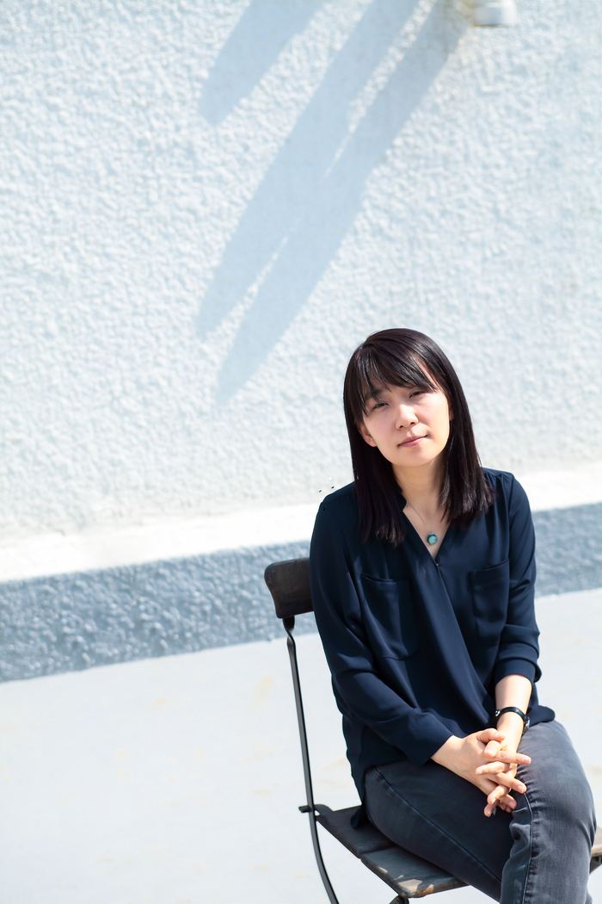
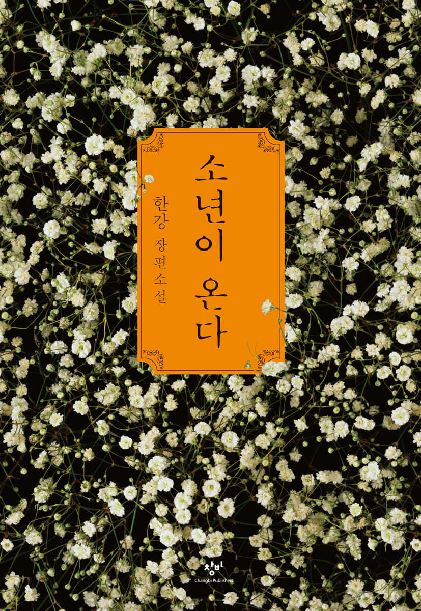
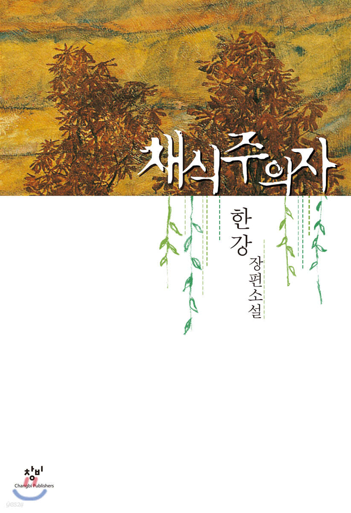
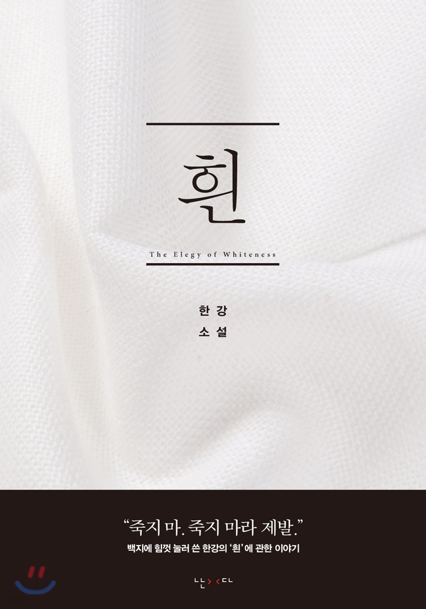

<!DOCTYPE html>
<html>
<head><meta charset="utf-8">
<title>우진's 미니홈페이지 "노벨문학상을 받은 한강작가" 인물편</title></head>
<body>
    <header>
        <h1>우진's 미니홈페이지 "노벨문학상을 받은 한강작가" 인물편</h1>
        

        <h2 id='clock'></h2>
        
        <h3>홈페이지 로그인</h3>
        <form name="fo" method="get">
            사용자 ID: <input type="text" size="15" value="woojin"> 
            비밀 번호: <input type="password" size="15" value="202401505">
              <input type="submit" vale="완료">
            <input type="reset">
            

            <h3>게시물 간단소개</h3>
        
2024년 대한민국을 깜짝 놀라게 한 이름, 노벨문학상 수상자 한강! 그녀는 누구일까요? 같이 알아봅시다

    </header>
<nav>
    <h2>목차</h2><h5>(클릭시 바로 해당 부분으로 이동)</h5>
    <ol>
        <li><a href="#who">작가소개</a></li>
        <li><a href="#what">섹션소개</a></li>
        <li><a href="#react">독자리뷰 및 반응</a></li>
        <li><a href="#speach">노벨문학상 수상 연설</a></li>
    </ol>
</nav>
<section>
    <article id="who">
        <h2>작가소개</h2>
        
        
 소개: 한강은 섬세하면서도 강렬한 문체와 철학적 주제로 세계적인 주목을 받는 대한민국의 현대 작가입니다. 
            대표작으로 《채식주의자》, 《소년이 온다》 등이 있으며, 특히 《채식주의자》로 2016년 맨부커 국제상을 수상했습니다.  
            그녀의 작품은 인간의 본성과 고통, 기억, 연대 등을 깊이 있게 탐구하며 독자들에게 큰 울림을 전합니다.

    </article>
    <article id="what">
        <h2>섹션소개</h2><h3>(사진 클릭시 구매사이트 이동)</h3>
        <h4>1. 소년이 온다</h4>
        
        
 줄거리: 《소년이 온다》는 5·18 광주민주화운동을 배경으로, 군사정권의 폭력 속에서 희생된 중학생 동호와 
            그를 둘러싼 인물들의 고통과 기억을 다룬 소설입니다. 동호는 친구의 시신을 찾으려다 희생되며,  
            소설은 그의 죽음을 중심으로 생존자와 주변 사람들의 시선을 통해 비극을 생생히 그려냅니다. 
            국가폭력의 잔혹함을 기록하고, 기억과 연대의 중요성을 강렬하게 전달합니다.

             
             
        <h4>2. 채식주의자</h4>
        
        

            줄거리: 《채식주의자》는 평범한 주부 영혜가 채식주의를 선언하며 벌어지는 갈등과 변화를 다룬 소설입니다. 
            그녀의 결정은 가족과 사회의 규범에 큰 충격을 주며, 점차 그녀는 육체와 정신의 경계가 무너지는 
            극단적 변화를 겪게 됩니다. 작품은 인간의 폭력성, 자유, 그리고 욕망에 대한 깊은 질문을 던집니다.

             
             
        <h4>3. 흰</h4>
        
        

            줄거리: 《흰》은 상실과 치유를 중심으로 한 작품으로, 주인공이 고통과 죽음을 마주하며 삶의 의미를 찾으려는 
            이야기를 담고 있습니다. 주인공은 가족과의 관계, 과거의 상처를 되돌아보며, 흰색이라는 상징을 통해 
            깨달음을 얻고자 합니다. 작품은 존재와 죽음, 삶의 무상함을 탐구하며 깊은 철학적 질문을 제기합니다. 
        

         
         
        <h4>4. 작별하지 않는다</h4>
        
        

        줄거리: 《작별하지 않는다》는 한 여자가 죽음을 앞둔 사랑하는 사람과의 마지막 시간을 보내며, 그 안에서 감정의 
        갈등과 치유를 그린 소설입니다. 주인공은 이별을 준비하며 과거를 되돌아보고, 서로에게 진정으로 
        필요한 것들을 깨닫습니다. 작품은 사랑과 죽음, 이별을 통해 삶의 의미를 깊이 탐구합니다. 
        

         
         
        <h4>5. 서랍에 저녁을 넣어 두었다</h4>
        
        

            줄거리: 《사람을 저녁에 넣어 두었다》는 한 여자가 고독과 상처를 안고 살아가는 이야기를 그린 소설입니다. 
            주인공은 일상에서 점차적으로 자신을 잃어가며, 사람들과의 관계에서 벗어나 자신만의 세계에 갇히게 됩니다. 
            이 작품은 인간 존재의 외로움과 회복의 과정을 깊이 탐구합니다. 
        

    </article>
    <article id="react">
        <h2>독자리뷰 및 반응</h2>
        

            <h3>1. 소년이 온다 </h3>
            
그림자: 사회적, 역사적 배경을 바탕으로 한 강렬한 메시지와 섬세한 감정선에 대한 반응이 좋았어요.

            
여백의 독자: 이야기의 흐름과 전개가 다소 느리게 느껴졌어요ㅠㅠ.

            <h3>2. 채식주의자 </h3>
            
무명의여행자: 작품의 독특한 구성과 정신적, 신체적 변화를 다룬 점이 매우 흥미로웠어요!

            
속삭이는 바람: 충격적인 전개와 비유적 요소가 혼란스러웠지만, 강렬한 인상을 남겼어요.

            <h3>3. 흰 </h3>
            
 불꽃의 고요: 주제나 이야기의 흐름이 어렵고 난해하게 느껴졌어요ㅠㅠ.

            <h3>4. 작별하지 않는다</h3>
            
 점검의 시간: 감성적이고 여운이 남는 작품으로 기억에 남아요.

            
비밀의 정원: 슬픈 감정을 전달하는 점이 저에겐 부담이 되었어요.

            <h3>5. 서랍속에 저녁을 넣어 두었다</h3>
            
 새벽의 노래: 일상 속에서 삶의 의미를 찾으려는 태도에 대해 긍정적으로 평가했어요!

        

    <article id="speach">
        <h2>노벨문학상 수상 연설</h2>
        <video src="한강 작가 연설.mp4" width="400" height="450" controls></video>
    </article>
</section>
<h3>*재밌는 지식:   한강 작가는 언제 글을 쓸까?</h3>

한강 작가는 종종 밤 시간에 글을 씁니다. 고요한 밤의 정적이 창작에 더 좋은 영감을 준다고 합니다. 
    그녀는 손으로 직접 글을 쓰기도 하고, 때로는 스케치북이나 노트에 대강의 아이디어를 적어 놓은 뒤 이를 다듬어 작품으로 완성한다고 알려져 있습니다.

<footer>
    
글쓴이: 202401505 김우진

    
출처: 네이버, 구글, 유튜브

</footer>
</body>
</html>
